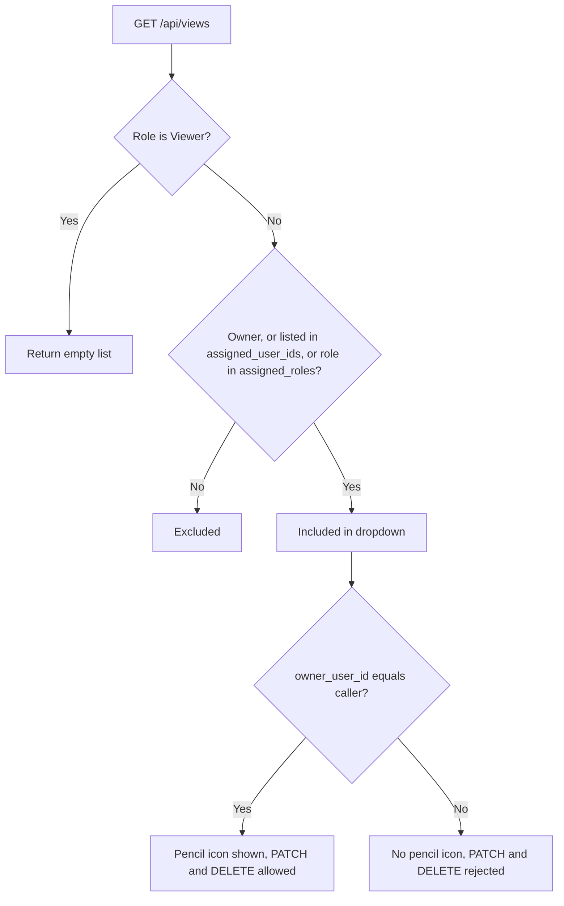

# Saved Views and Inherited Views

A saved view bundles a set of visible columns, a filter condition tree, a sort order, and
a display order into a named entry in the Records view dropdown. Views live in
`data/saved-views.csv` and are typed as `SavedView` in `src/types.ts`.

Originally every view was private: `GET /api/views` returned only rows whose
`owner_user_id` matched the caller. Views can now also be shared, which is what the
product calls an **inherited view**.

## The two sharing dimensions

| Field | Meaning |
| --- | --- |
| `assigned_user_ids` | Specific users who receive the view |
| `assigned_roles` | Every user holding one of these roles receives the view |

Both empty means the view stays private to its owner. The view editor presents this
default as **"Me"**.

Only Managers and Administrators can set either field (`canAssignViews`). An Analyst
creating a view sees no assignment control at all, and the server rejects an Analyst that
submits a non-empty assignment.

## Who sees what

A user's view dropdown contains the built-in All Records entry plus every saved view
where any of the following holds:

1. they own it, or
2. their `user_id` appears in `assigned_user_ids`, or
3. their `role_access` appears in `assigned_roles`.

Viewers are excluded entirely — `canUseSavedViews` is false for them, so the endpoint
returns an empty list and `Viewer` is never a legal entry in `assigned_roles`.

## Editing rules

Editability is ownership, not role. `canEditView(user, view)` compares
`view.owner_user_id` to `user.user_id`. Consequences:

- A Manager can edit the views they authored, including ones they shared out.
- An Analyst who inherited a view sees **no pencil icon** next to it and cannot rename,
  refilter, or delete it. They can only select it.
- A Manager who inherited a view from a different Manager also cannot edit it. Being a
  Manager does not grant edit rights over another Manager's view.
- The server enforces this independently of the UI: `PATCH /api/views/:id` and
  `DELETE /api/views/:id` both require ownership.

View name uniqueness is scoped per owner, so two different Managers can each have a view
called "This Month Records" without colliding.

## The two product cases

**Case 1 — a whole role.** Every Analyst wants a view called "This Month Records". A
Manager opens `+ New View`, configures the columns and conditions, and on the Information
tab sets User Assignment to `Assign to all "Analyst" Users`. This writes
`assigned_roles: ["Analyst"]`. Every current and future Analyst sees the view, with no
pencil icon. The Manager remains the only person who can change it.

**Case 2 — specific people.** Only John and Sarah want "Shared Month Records - John and
Sarah". The Manager creates the view and multi-selects just those two users in the User
Assignment list. This writes `assigned_user_ids: ["1", "5"]` and leaves `assigned_roles`
empty. No other Analyst sees it.

Because role assignment is evaluated at read time rather than expanded into a user list
at write time, a user added to the platform later automatically inherits every view
assigned to their role. That is intentional.

## Edge cases

- Assigning a view to a role *and* to individual members of that role is harmless; the
  read path de-duplicates.
- A user assigned a view individually who also owns it sees it once, and can edit it.
- Deleting a user does not rewrite the views that referenced them. A stale id in
  `assigned_user_ids` simply never matches. Cleaning that up is a future concern.
- The built-in All Records view is not a row in the CSV. It is synthesized by
  `allRecordsView()` with the sentinel id `__all__` and is always available to everyone
  who can reach the Records tab.
